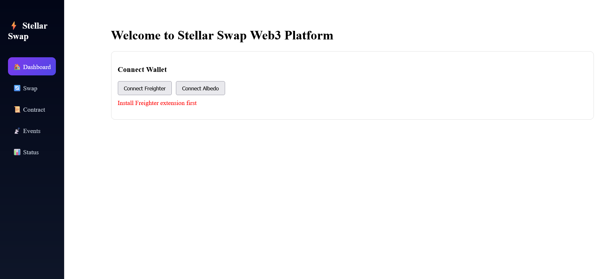
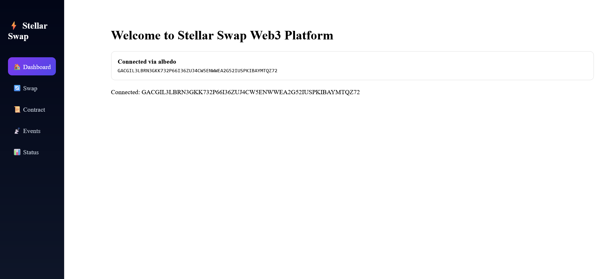
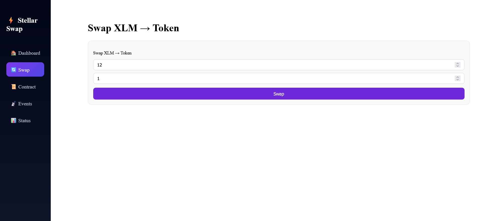
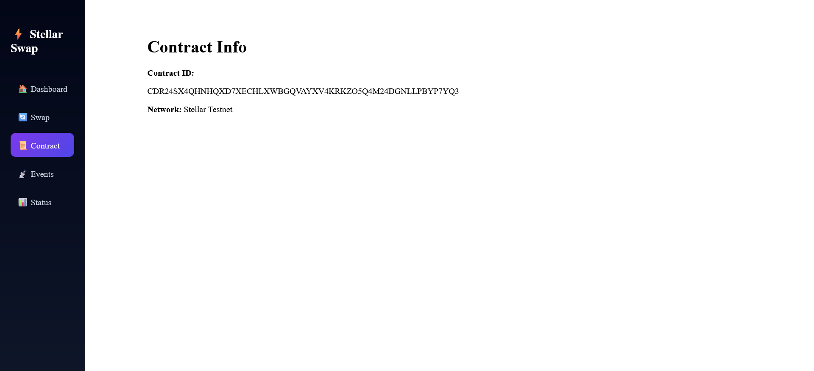
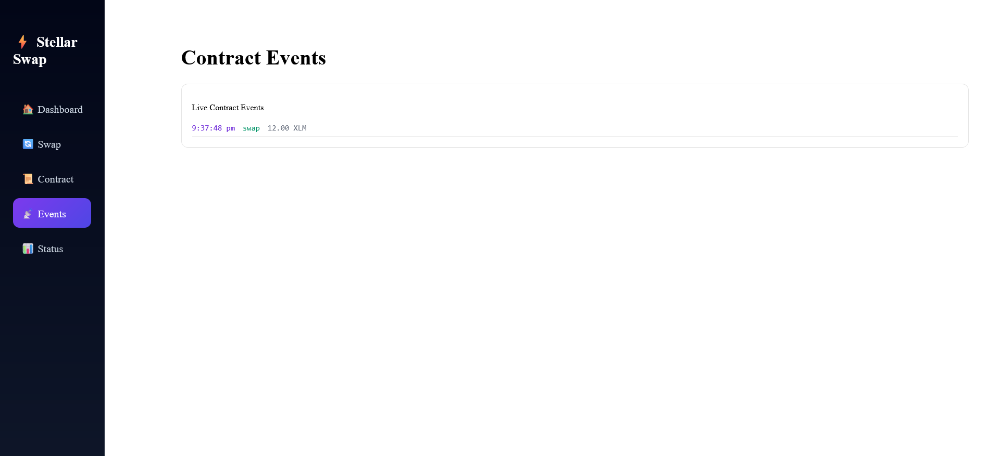
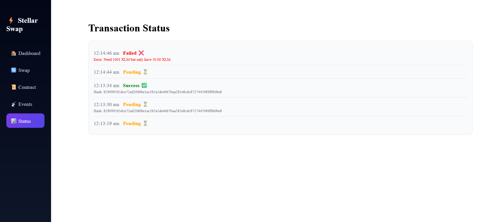
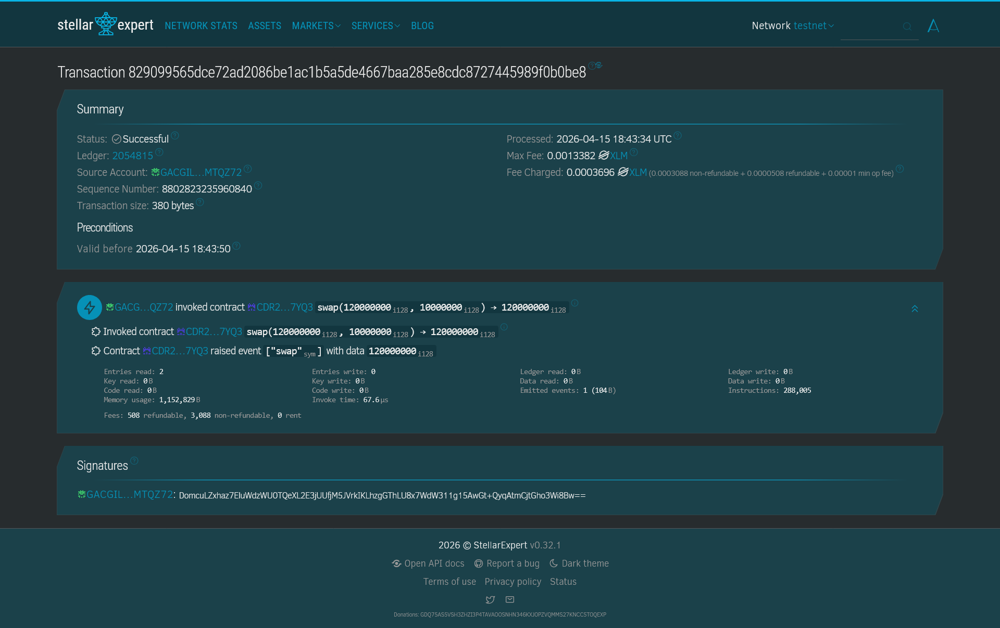

# Steller-Token-Swap-L2 #

🚀 Token Swap – Stellar Soroban Web3 dApp

A multi-wallet Token Swap Web3 application built using Stellar Soroban Smart Contracts with real-time event tracking and transaction status monitoring.

This project was created as part of the Stellar Builder Challenges – Level 2 (Yellow Belt Submission).

---

🌟 Features

✅ Multi-wallet connection (Albedo / Stellar Wallets Kit)
✅ Smart contract deployed on Stellar Testnet
✅ Swap XLM → Token using Soroban contract
✅ Real-time contract event listener
✅ Transaction status tracking (Pending / Success / Failed)
✅ Error handling:

- Wallet not connected
- Transaction rejected
- Insufficient balance

---

🧱 Tech Stack

Frontend

- React (Vite)
- Stellar Wallets Kit
- Stellar SDK

Smart Contract

- Rust
- Soroban SDK

Network

- Stellar Soroban Testnet

---
## Wallet Integration

This project integrates Stellar wallets using a dedicated integration file:

src/walletIntegration.js

Supported wallets:

- Freighter
- Albedo

Error handling implemented:

- Wallet not found
- Transaction rejected
- Insufficient balance
----- 

## 📂 Project Structure

```
token-swap/
│
├── contract/                  # Soroban smart contract (Rust)
│   ├── src/
│   │   └── lib.rs
│   ├── Cargo.toml
│   └── Cargo.lock
│
├── src/
│   ├── Components/
│        └── SwapForm.jsx
|           |--sidebar.jsx
|           |---Eventlog.jsx
|           |---WalletSelector.jsx
|           |---TxStatus.jsx
|          
│
│   ├── layout/
│   │   └── Navbar.jsx
│
│   ├── pages/
│   │   ├── Dashboard.jsx
│   │   ├── SwapPage.jsx
│   │   ├── ContractPage.jsx
│   │   ├── EventsPage.jsx
│   │   └── StatusPage.jsx
│
│   ├── contractClient.js      # Contract interaction logic
│   ├── eventListener.js       # Real-time event listener
│   ├── WalletIntegration.js           # Wallet integration
│   ├── App.jsx
│   └── main.jsx
│
├── index.html
├── package.json
├── vite.config.js
└── README.md
```

🔗 Smart Contract Details

Network: Stellar Testnet
Contract Address:

CDR24SX4QHNHQXD7XECHLXWBGQVAYXV4KRKZO5Q4M24DGNLLPBYP7YQ3

---

📊 Transaction Example (Explorer Link)

Example swap transaction hash:

829099565dce72ad2086be1ac1b5a5de4667baa285e8cdc8727445989f0b0be8


Verify here:

https://stellar.expert/explorer/testnet


⚡ Setup Instructions

1️⃣ Clone Repository

git clone https://github.com/MAYANK-PI/Steller-Token-Swap-L-2

---

2️⃣ Install Dependencies

npm install

---

3️⃣ Run Frontend

npm run dev

App runs at:

http://localhost:5173

---

4️⃣ Build Smart Contract

Inside contract folder:

cd contract
cargo build --target wasm32-unknown-unknown --release

---

5️⃣ Deploy Contract (Testnet)

Example:

soroban contract deploy \
--wasm target/wasm32-unknown-unknown/release/token_swap.wasm \
--source YOUR_IDENTITY \
--network testnet

---

📡 Real-Time Features Implemented

This app includes:

Event Listening

Detects contract swap events instantly:

swap 12.00 XLM

---

Transaction Status Tracking

Tracks:

Pending ⏳
Success ✅
Failed ❌

---

Error Handling Supported

Error Type| Status
Wallet not connected| ✅
Transaction rejected| ✅
Insufficient balance| ✅

---

👛 Supported Wallets

- Albedo
- Freighter (optional support)
- Stellar Wallet Kit compatible wallets

---

🎯 Challenge Requirements Completed

✔ Contract deployed on testnet
✔ Contract called from frontend
✔ Real-time event listener working
✔ Transaction status tracking implemented
✔ 3 error types handled
✔ Multi-wallet integration completed

---
## Screenshots

### Wallet Connection


---

### Wallet Options Selection



---

### Dashboard Page



---

### Swap Interface



---

### Contract Interaction Page



---

### Contract Events Listener (Real-time)



---

### Transaction Status Tracking



---

### Stellar Testnet Configuration



👨‍💻 Author

Mayank Raj kushwaha

Stellar Soroban Developer 🚀
